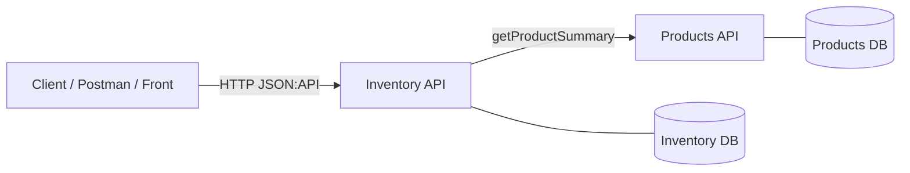
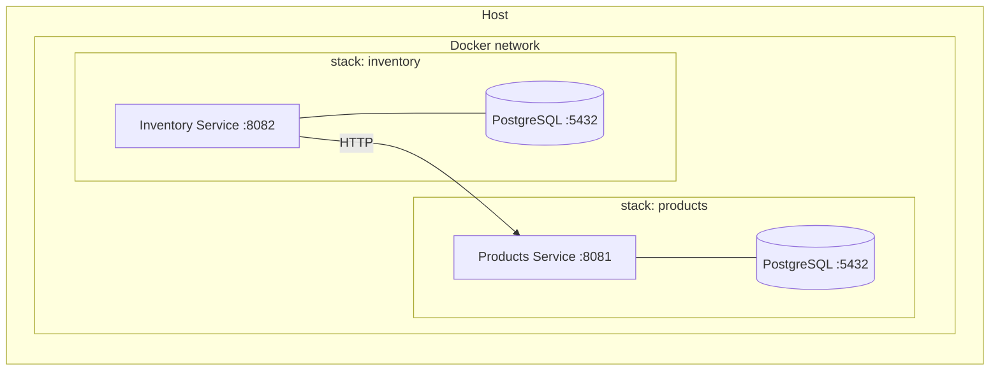
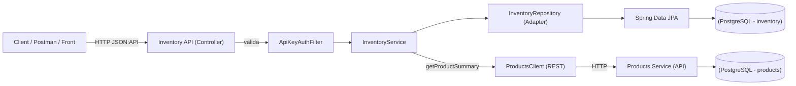

# Prueba Técnica Linktic (Monorepo)

Este repositorio contiene **dos microservicios**:

- **products_service**: gestión de productos (nombre, precio, etc.).
- **inventory_service**: gestión de inventario y consulta de stock por `productId`, integrándose con **products_service** para obtener la información del producto.

**Stack común**: Spring Boot 3, Java 17, Spring Data JPA, PostgreSQL, Flyway, Spring Security (API Key), Springdoc OpenAPI, MapStruct, Logback JSON.  
**Formato de respuestas**: **JSON:API** (`application/vnd.api+json`).  
**Contenedores**: Docker + Docker Compose.  
**Pruebas**: Unitarias con JaCoCo (objetivo ≥ 80%).

---

## Arquitectura (alto nivel)



- **Inventory** llama a **Products** para enriquecer la respuesta con datos del producto.
- Cada servicio tiene su propia base de datos PostgreSQL.
- Seguridad por **API Key** en ambos servicios.

**Deployment (compose / redes / puertos):**:


**Arquitectura de integración Inventory–Products (flujo de llamadas):**:


**Arquitectura de alto nivel (hexagonal) — Products & Inventory:**:

---

## Decisiones técnicas y justificaciones

- JSON:API: contrato uniforme (data, errors, links, meta), facilita clientes y manejo de errores.

- API Key: autenticación simple y suficiente para la prueba; en producción se evaluaría JWT/OAuth2.

- PostgreSQL por servicio: independencia de esquema, escalabilidad y despliegue desacoplado; integraciones vía REST (no cross-DB).

- Flyway: versionamiento del esquema reproducible en cualquier entorno.

- Arquitectura hexagonal + Repository: dominio aislado de infraestructura (tests más simples, adaptadores intercambiables).

- MapStruct: mapeo DTO↔entidades en compile-time (seguridad y rendimiento).

- Logback JSON + Actuator: logs estructurados listos para ELK y health checks estándar.

---

## Cómo ejecutar todo con un único `docker-compose` (raíz)

En la **raíz** del repo, crea (o usa) un `docker-compose.yml` que orquesta ambos servicios y sus bases de datos en **la misma red**:

```yaml
services:
  products-postgres:
    image: postgres:15
    container_name: products-postgres-1
    environment:
      POSTGRES_DB: products
      POSTGRES_USER: postgres
      POSTGRES_PASSWORD: postgres
    ports:
      - "5432:5432"
    volumes:
      - ./products_service/data/postgres:/var/lib/postgresql/data
    healthcheck:
      test: ["CMD-SHELL","pg_isready -U $${POSTGRES_USER} -d $${POSTGRES_DB}"]
      interval: 5s
      timeout: 5s
      retries: 10

  inventory-postgres:
    image: postgres:15
    container_name: inventory-postgres-1
    environment:
      POSTGRES_DB: inventory
      POSTGRES_USER: postgres
      POSTGRES_PASSWORD: postgres
    ports:
      - "5433:5432"
    volumes:
      - ./inventory_service/data/postgres:/var/lib/postgresql/data
    healthcheck:
      test: ["CMD-SHELL","pg_isready -U $${POSTGRES_USER} -d $${POSTGRES_DB}"]
      interval: 5s
      timeout: 5s
      retries: 10

  products-service:
    build: ./products_service
    container_name: products-service-1
    depends_on:
      products-postgres:
        condition: service_healthy
    ports:
      - "8081:8081"
    environment:
      DB_URL: jdbc:postgresql://products-postgres:5432/products
      DB_USER: postgres
      DB_PASS: postgres
      PRODUCTS_API_KEY: dev-products-key
    healthcheck:
      test: ["CMD","curl","-f","http://localhost:8081/actuator/health"]
      interval: 10s
      timeout: 3s
      retries: 10

  inventory-service:
    build: ./inventory_service
    container_name: inventory-service-1
    depends_on:
      inventory-postgres:
        condition: service_healthy
    ports:
      - "8082:8082"
      - "5006:5006"
    environment:
      DB_URL: jdbc:postgresql://inventory-postgres:5432/inventory
      DB_USER: postgres
      DB_PASS: postgres
      INVENTORY_API_KEY: dev-inventory-key
      # importante para resolver el Products desde dentro de la red del compose:
      INVENTORY_PRODUCTS_BASE_URL: http://products-service:8081
      INVENTORY_PRODUCTS_API_KEY_HEADER: X-API-Key
      INVENTORY_PRODUCTS_API_KEY_VALUE: dev-products-key
    healthcheck:
      test: ["CMD","curl","-f","http://localhost:8082/actuator/health"]
      interval: 10s
      timeout: 3s
      retries: 10
```

**Comandos**:
```bash
docker compose up -d --build
docker compose logs -f
docker compose down
```

> Si ya tienes `docker-compose.yml` dentro de cada microservicio y prefieres dejarlos separados, puedes crear una **red externa** y unir ambos (`docker network create msnet`) y añadir en cada compose:
> ```yaml
> networks:
>   default:
>     name: msnet
>     external: true
> ```

---

## Probar rápidamente

1. **Crear producto** (Products):
```bash
curl -X POST "http://localhost:8081/products"   -H "X-API-Key: dev-products-key"   -H "Content-Type: application/vnd.api+json"   -d '{"data":{"type":"products","attributes":{"name":"Mouse","price":19.99}}}'
```

2. **Crear inventario** (Inventory):
```bash
curl -X POST "http://localhost:8082/inventories"   -H "X-API-Key: dev-inventory-key"   -H "Content-Type: application/vnd.api+json"   -d '{"data":{"type":"inventories","attributes":{"productId":1,"quantity":10}}}'
```

3. **Consultar detalle combinado** por `productId` (Inventory):
```bash
curl -H "X-API-Key: dev-inventory-key"   "http://localhost:8082/inventories/product/1"
```

---

## Endpoints principales

### Products
- `POST /products`
- `GET /products/{id}`
- `GET /products/list`
- `GET /products/paginated?pageNumber=1&pageSize=10`

**Swagger**: <http://localhost:8081/swagger-ui/index.html>  
**Health**: <http://localhost:8081/actuator/health>

### Inventory
- `POST /inventories`
- `GET /inventories/{id}`
- `GET /inventories/product/{productId}` *(detalle con info de producto)*
- `PUT /inventories/{id}`
- `POST /inventories/purchase`
- `GET /inventories/list`
- `GET /inventories/paginated?pageNumber=1&pageSize=10`

**Swagger**: <http://localhost:8082/swagger-ui/index.html>  
**Health**: <http://localhost:8082/actuator/health>

---

## Variables de entorno (resumen)

| Servicio   | Variable                                 | Ejemplo/Default                          |
|------------|------------------------------------------|------------------------------------------|
| Products   | `PRODUCTS_API_KEY`                       | `dev-products-key`                       |
| Products   | `DB_URL`                                  | `jdbc:postgresql://products-postgres:5432/products` |
| Products   | `DB_USER` / `DB_PASS`                    | `postgres` / `postgres`                  |
| Inventory  | `INVENTORY_API_KEY`                      | `dev-inventory-key`                      |
| Inventory  | `INVENTORY_PRODUCTS_BASE_URL`            | `http://products-service:8081`           |
| Inventory  | `INVENTORY_PRODUCTS_API_KEY_HEADER`      | `X-API-Key`                               |
| Inventory  | `INVENTORY_PRODUCTS_API_KEY_VALUE`       | `dev-products-key`                       |
| Inventory  | `DB_URL`                                  | `jdbc:postgresql://inventory-postgres:5432/inventory` |
| Inventory  | `DB_USER` / `DB_PASS`                    | `postgres` / `postgres`                  |

> **Nota**: en local sin Docker, `INVENTORY_PRODUCTS_BASE_URL` puede ser `http://localhost:8081`.  
> En Linux, si corres products en host y inventory en contenedor, usa `host.docker.internal` y añade `extra_hosts` si es necesario.

---

## Desarrollo local (sin Docker)

- **Products**:
  ```bash
  cd products_service
  ./gradlew bootRun
  ```
- **Inventory**:
  ```bash
  cd inventory_service
  ./gradlew bootRun
  ```

Asegúrate de tener PostgreSQL corriendo y de configurar `DB_URL/DB_USER/DB_PASS` apropiadamente.

---

## Pruebas y cobertura

```bash
./gradlew clean test
# Reporte de tests:
# products_service/build/reports/tests/test/index.html
# inventory_service/build/reports/tests/test/index.html

# Cobertura JaCoCo:
# products_service/build/reports/jacoco/test/html/index.html
# inventory_service/build/reports/jacoco/test/html/index.html
```

---

## Estructura del repo

```
/
├─ products_service/
│  ├─ src/main/java/... 
│  ├─ src/test/java/...
│  ├─ Dockerfile
│  ├─ docker-compose.yml (opcional si usas el de raíz)
│  └─ README.md
├─ inventory_service/
│  ├─ src/main/java/...
│  ├─ src/test/java/...
│  ├─ Dockerfile
│  ├─ docker-compose.yml (opcional si usas el de raíz)
│  └─ README.md
└─ docker-compose.yml  # orquestación raíz (recomendado)
```

---

## Convenciones

- **JSON:API** como contrato de respuesta.
- **API Key** en header (configurable). Endpoints públicos: `/v3/api-docs/**`, `/swagger-ui/**`, `/actuator/**`.
- **Commits**: *Conventional Commits* sugerido (`feat:`, `fix:`, `docs:`, `test:`, `chore:`, `build:`).

---

## Autor

- **Cristian Pianda**
