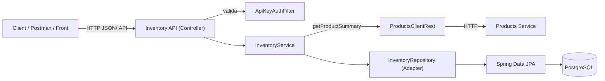

# Inventory Service

Microservicio **Inventory** para gestionar existencias y consultar stock por producto, integrándose con el **Products Service** para obtener la información del producto.

- **Stack**: Spring Boot 3, Java 17, Spring Data JPA, PostgreSQL, Flyway, Spring Security (API Key), Springdoc OpenAPI, MapStruct, Logback (JSON).
- **Estándar de respuestas**: **JSON:API** (`application/vnd.api+json`).
- **Contenedores**: Docker + Docker Compose.
- **Pruebas**: Unitarias con cobertura **≥ 80%** (JaCoCo).

---

## Arquitectura (alto nivel)



**Decisiones clave**
- **JSON:API** para consistencia del envelope (`data`, `links`, `meta`) y errores (`errors[]`).
- **API Key** simple (header configurable). Endpoints públicos: `/v3/api-docs/**`, `/swagger-ui/**`, `/actuator/**`.
- **PostgreSQL + Flyway** para versionado de esquema y reproducibilidad.
- **Logs estructurados** para observabilidad (`logstash-logback-encoder`).

---

## Ejecutar con Docker

1) **Levantar DB + servicio**:
```bash
docker compose up -d --build
```

2) **Ver logs**:
```bash
docker compose logs -f
# o solo el microservicio
docker compose logs -f inventory_service
```

3) **Detener**:
```bash
docker compose down
```

**Healthchecks**
- Servicio: `GET http://localhost:8082/actuator/health`
- Postgres: `pg_isready` (incluido en el compose).

> Asegúrate de que el `docker-compose.yml` del servicio use el puerto **8082** en el healthcheck del microservicio.

---

## Ejecutar local sin Docker

**Requisitos**: Java 17 + PostgreSQL

1) Crear DB `inventory` y credenciales (o usar defaults):
```bash
DB_URL=jdbc:postgresql://localhost:5432/inventory
DB_USER=postgres
DB_PASS=postgres
```

2) Variables (vía env o `application.yml`):
```bash
# API key del Inventory
INVENTORY_API_KEY=dev-inventory-key

# Integración con Products Service
INVENTORY_PRODUCTS_BASE_URL=http://localhost:8081
INVENTORY_PRODUCTS_API_KEY_HEADER=X-API-Key
INVENTORY_PRODUCTS_API_KEY_VALUE=dev-products-key
```

3) Arrancar:
```bash
./gradlew bootRun
```

---

## Configuración

- `application.yml`
    - `server.port` por defecto **8082**
    - `spring.datasource.*` con fallback a env `DB_URL/DB_USER/DB_PASS`
    - `spring.jpa.hibernate.ddl-auto=validate`
    - `spring.flyway.enabled=true`, `baseline-on-migrate=true`
    - `springdoc` configurado para JSON:API (default media types)
- `application.properties` (opcional)

**Seguridad**
- `security.api-key.header` (default: `X-API-Key`)
- `security.api-key.value` (o `INVENTORY_API_KEY`)

**Integración con Products**
- `inventory.products.base-url` (o `INVENTORY_PRODUCTS_BASE_URL`)
- `inventory.products.api-key.header` (o `INVENTORY_PRODUCTS_API_KEY_HEADER`)
- `inventory.products.api-key.value` (o `INVENTORY_PRODUCTS_API_KEY_VALUE`)

---

## Seguridad (API Key)

Enviar el header en cada request:
```text
X-API-Key: dev-inventory-key
```
**Rutas públicas**: `/v3/api-docs/**`, `/swagger-ui/**`, `/actuator/**`.  
El resto requiere API Key válida; si no, retorna **401** con envelope JSON:API.

---

## JSON:API (convenciones)

- **Content-Type / Accept**: `application/vnd.api+json`
- **Éxito** (ejemplo real y válido):
```json
{
  "data": {
    "type": "inventories",
    "id": "1",
    "attributes": {
      "productId": 100,
      "quantity": 10
    }
  },
  "links": {
    "self": "/inventories/1"
  },
  "meta": {
    "requestId": "a7f1e9b2-1a2b-4cf0-bf8d-2e2be5d4c9a1"
  }
}
```
- **Error** (formato válido):
```json
{
  "errors": [
    {
      "status": "400",
      "title": "Bad Request",
      "detail": "quantity must be >= 0"
    }
  ]
}
```

---

## Endpoints

### Crear inventario
`POST /inventories`  
Headers: `Content-Type: application/vnd.api+json`, `X-API-Key: ...`

**Request**
```json
{
  "data": {
    "type": "inventories",
    "attributes": {
      "productId": 100,
      "quantity": 10
    }
  }
}
```

**201 Created** → `data` con `id`, `productId`, `quantity`

---

### Obtener inventario por **ID**
`GET /inventories/{id}` → **200 OK** | **404 Not Found**

**cURL**
```bash
curl -H "X-API-Key: dev-inventory-key" http://localhost:8082/inventories/1
```

---

### Obtener **stock** e info de **producto** por `productId`
`GET /inventories/product/{productId}`

**200 OK** (ejemplo)
```json
{
  "data": {
    "type": "inventories",
    "id": "5",
    "attributes": {
      "productId": 777,
      "quantity": 9,
      "product": { "id": 777, "name": "Mouse", "price": 19.99 }
    }
  },
  "links": { "self": "/inventories/product/777" }
}
```

> Este endpoint consulta al **Products Service** para armar el `product` y obtiene el `quantity` local.

---

### Actualizar cantidad
`PUT /inventories/{id}`

**Request**
```json
{
  "data": {
    "type": "inventories",
    "attributes": { "quantity": 25 }
  }
}
```

**200 OK** | **404** | **400** (`quantity >= 0`).

---

### Registrar compra (restar unidades)
`POST /inventories/purchase`

**Request**
```json
{
  "data": {
    "type": "inventories",
    "attributes": {
      "productId": 777,
      "units": 2
    }
  }
}
```

**200 OK** con inventario actualizado.  
Reglas: `units > 0`, no permite stock negativo → **400 "insufficient stock"**.

---

### Eliminar
`DELETE /inventories/{id}` → **204 No Content** | **404**

---

### Listado simple
`GET /inventories/list` → **200 OK** con `data[]`

---

### Listado paginado
`GET /inventories/paginated?pageNumber=1&pageSize=10`

**Respuesta**:
```json
{
  "data": [
    {
      "type": "inventories",
      "id": "1",
      "attributes": { "productId": 100, "quantity": 10 }
    }
  ],
  "links": {
    "self": "/inventories/paginated?pageNumber=1&pageSize=10",
    "first": "/inventories/paginated?pageNumber=1&pageSize=10",
    "last": "/inventories/paginated?pageNumber=3&pageSize=10",
    "next": "/inventories/paginated?pageNumber=2&pageSize=10",
    "prev": null
  },
  "meta": {
    "totalElements": 25,
    "totalPages": 3,
    "pageNumber": 1,
    "pageSize": 10
  }
}
```

> Próxima mejora: admitir `page[number]` y `page[size]` (estilo JSON:API).

---

## Errores (JSON:API)

**404**
```json
{
  "errors": [
    { "status": "404", "title": "Not Found", "detail": "Inventory not found." }
  ]
}
```

---

## Observabilidad

- **Logs**: salida JSON (logback + logstash encoder).
- **Health**: `/actuator/health` (usado en healthcheck de Docker).

---

## Swagger / OpenAPI

- UI: `http://localhost:8082/swagger-ui/index.html`
- Docs: `http://localhost:8082/v3/api-docs`
- Seguridad documentada como API Key (header configurable).
- Media type por defecto: `application/vnd.api+json`.

---

## Tests y cobertura

- **Unitarios**: servicios (create/update/purchase/details), controladores (JSON:API), repositorio adapter, cliente REST de productos, filtro de seguridad y handler de excepciones.
- **Cobertura objetivo**: **≥ 80%** (JaCoCo).

**Comandos**
```bash
./gradlew clean test
# Reporte: build/reports/tests/test/index.html
# Cobertura: build/reports/jacoco/test/html/index.html
```

> En Windows con OneDrive, evita rutas sincronizadas para reducir locks durante `test`.

---

## Estructura del proyecto

```text
inventory_service/
 ├─ src/main/java/com/linktic/inventory_service
 │   ├─ InventoryApplication.java
 │   ├─ config/         # Security (API Key), OpenAPI, RestTemplate, props
 │   ├─ domain/         # Modelo y servicios de dominio
 │   ├─ infrastructure/ # JPA, mappers, adapter, ProductsClientRest
 │   └─ web/            # Controllers, DTOs JSON:API, error handler
 ├─ src/main/resources/
 │   ├─ db/migration/   # Flyway (V1__init_inventory.sql)
 │   ├─ application.yml
 │   └─ logback-spring.xml
 ├─ Dockerfile
 ├─ docker-compose.yml
 └─ build.gradle
```

---

## Roadmap (mejoras sugeridas)

- Compatibilidad de paginación **JSON:API** (`page[number]` / `page[size]`).
- **422 Unprocessable Entity** para reglas de dominio (hoy 400).
- Validación estricta del campo `data.type` (`"inventories"`) en requests.
- **Correlation-Id** (filtro + MDC) para trazabilidad entre servicios.
- **Idempotency-Key** en operaciones sensibles.

---

## Autor

- **Cristian Pianda**
