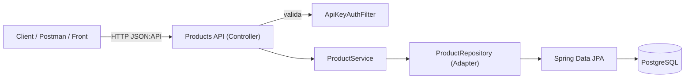

# Products Service

Microservicio **Products** para gestionar productos de la aplicación.

- **Stack**: Spring Boot 3, Java 17, Spring Data JPA, PostgreSQL, Flyway, Spring Security (API Key), Springdoc OpenAPI.
- **Estándar de respuestas**: **JSON:API** (`application/vnd.api+json`).
- **Contenedores**: Docker + Docker Compose.
- **Pruebas**: Unitarias con cobertura **≥ 80%** (JaCoCo).

---

## Arquitectura (alto nivel)



**Decisiones clave**
- **JSON:API** para consistencia de envelope (`data`, `links`, `meta`) y errores (`errors[]`).
- **API Key** simple: header `X-API-Key`. Endpoints públicos: `/v3/api-docs/**`, `/swagger-ui/**`, `/actuator/**`.
- **PostgreSQL + Flyway** para versionado de esquema y reproducibilidad.
- **Logs estructurados** para mejor observabilidad (stack ELK/Cloud-native).

---

## Ejecutar con Docker

1) **Levantar todo** (DB + servicio):
```bash
docker compose up -d --build
```

2) **Ver logs**:
```bash
docker compose logs -f
# o solo el microservicio
docker compose logs -f products_service
```

3) **Detener**:
```bash
docker compose down
```

**Healthchecks**
- Postgres: `pg_isready` (incluido).
- Servicio: `/actuator/health` (incluido en `docker-compose.yml`).

> Sugerencia: si tu versión de Docker lo soporta, usa:
```yaml
depends_on:
  postgres:
    condition: service_healthy
```
para esperar a que la DB esté sana antes de levantar el servicio.

---

## Ejecutar local sin Docker

Requisitos: Java 17 + PostgreSQL.

1) Crear DB `products` y credenciales (o usa las por defecto):
```
DB_URL=jdbc:postgresql://localhost:5432/products
DB_USER=postgres
DB_PASS=postgres
```

2) Variables (opcional vía env o `application.yml`):
```
PRODUCTS_API_KEY=dev-products-key
```

3) Arrancar:
```bash
./gradlew bootRun
```

---

## Configuración

- `application.yml`
    - `server.port` por defecto **8081**
    - `spring.datasource.*` con fallback a env `DB_URL/DB_USER/DB_PASS`
    - `spring.jpa.hibernate.ddl-auto=validate`
    - `spring.flyway.enabled=true`, `baseline-on-migrate=true`
    - `springdoc` configurado para JSON:API (default media types)
- `application.properties` (opcional)
- **Seguridad**:
    - `security.api-key.header=X-API-Key`
    - `security.api-key.value` (o `PRODUCTS_API_KEY`)

---

## Seguridad (API Key)

Enviar el header en cada request:

```
X-API-Key: dev-products-key
```

**Rutas públicas**: `/v3/api-docs/**`, `/swagger-ui/**`, `/actuator/**`.  
El resto requiere API Key válida; si no, retorna `401` en formato JSON:API.

---

## JSON:API

- **Content-Type/Accept**: `application/vnd.api+json`
- **Éxito**: `{"data": { "type": "products", "id": "...", "attributes": {...} }, "links": {...}, "meta": {...}}`
- **Error**: `{"errors": [ { "status": "400", "title": "Bad Request", "detail": "..." } ] }`

---

## Endpoints

### Crear producto
`POST /products`  
Headers: `Content-Type: application/vnd.api+json`, `X-API-Key: ...`

**Request**
```json
{
  "data": {
    "type": "products",
    "attributes": {
      "name": "Mouse",
      "price": 19.99
    }
  }
}
```

**Responses**
- `201 Created` + body JSON:API con `data`
- `400 Bad Request` (validación) con `errors[]`

**cURL**
```bash
curl -X POST "http://localhost:8081/products"   -H "X-API-Key: dev-products-key"   -H "Content-Type: application/vnd.api+json"   -d '{"data":{"type":"products","attributes":{"name":"Mouse","price":19.99}}}'
```

---

### Obtener por id
`GET /products/{id}`  
**200 OK** o **404 Not Found** (JSON:API `errors[]`)

```bash
curl -H "X-API-Key: dev-products-key" http://localhost:8081/products/1
```

---

### Actualizar
`PUT /products/{id}`

```json
{
  "data": {
    "type": "products",
    "attributes": {
      "name": "Mouse Pro",
      "price": 24.90
    }
  }
}
```

**200 OK** o **404** o **400** (reglas de dominio, p.ej. `price > 0`).

---

### Eliminar
`DELETE /products/{id}` → **204 No Content** o **404 Not Found**

---

### Listado simple
`GET /products/list` → **200 OK** con `data[]`

---

### Listado paginado
`GET /products/paginated?pageNumber=1&pageSize=10`

**Respuesta**:
- `data[]`
- `links.self/first/last/next/prev`
- `meta.totalElements/totalPages/pageNumber/pageSize`

> **Nota**: actualmente los parámetros son `pageNumber` y `pageSize`.  
> Próxima mejora: admitir también el estilo JSON:API `page[number]` y `page[size]`.

---

## Errores (formato JSON:API)

Ejemplo `400`:

```json
{
  "errors": [
    {
      "status": "400",
      "title": "Bad Request",
      "detail": "price must be > 0"
    }
  ]
}
```

Ejemplo `404`:

```json
{
  "errors": [
    {
      "status": "404",
      "title": "Not Found",
      "detail": "Product not found."
    }
  ]
}
```

---

## Observabilidad

- **Logs**: salida estructurada en JSON (logback + logstash encoder).
- **Health**: `/actuator/health` (usado en healthcheck de Docker).

---

## Swagger / OpenAPI

- UI: `http://localhost:8081/swagger-ui/index.html`
- Docs: `http://localhost:8081/v3/api-docs`
- Seguridad documentada como API Key en header `X-API-Key`.
- Media type por defecto: `application/vnd.api+json`.

---

## Tests y cobertura

- **Unitarios**: servicios, controladores, seguridad, handler de excepciones.
- **Cobertura objetivo**: **≥ 80%** (JaCoCo).

**Comandos**
```bash
./gradlew clean test
# Reporte cobertura: build/reports/jacoco/test/html/index.html
```

> Si usas **Windows** con **OneDrive**, puede bloquear archivos durante `test`.  
> Recomendación: clonar el repo fuera de OneDrive (p.ej. `C:\dev\...`) o ejecutar:
> ```
> gradlew --stop
> gradlew cleanTest test --no-daemon
> ```

---

## Estructura del proyecto

```
products_service/
 ├─ src/main/java/com/linktic/products_service
 │   ├─ ProductsApplication.java
 │   ├─ config/         # Seguridad (API Key), OpenAPI
 │   ├─ domain/         # Modelo y servicios de dominio
 │   ├─ infrastructure/ # JPA, mappers y adaptadores
 │   └─ web/            # Controllers, DTOs JSON:API, error handler
 ├─ src/main/resources/
 │   ├─ db/migration/   # Flyway (V1__init_products.sql)
 │   ├─ application.yml
 │   └─ logback-spring.xml
 ├─ src/test/java/...   # Pruebas unitarias
 ├─ Dockerfile
 ├─ docker-compose.yml
 └─ build.gradle
```

---

## Roadmap (mejoras sugeridas)

- **Compatibilidad de paginación JSON:API**: admitir `page[number]` y `page[size]`.
- **422 Unprocessable Entity** para reglas de dominio (hoy 400).
- **Validación de `type`** en requests JSON:API (`"products"`).
- **Correlation-Id** (filtro + MDC) para trazabilidad entre servicios.
- **Idempotency-Key** en `PUT` para evitar dobles envíos.

---

## Créditos

- Autor: **Cristian Pianda**
